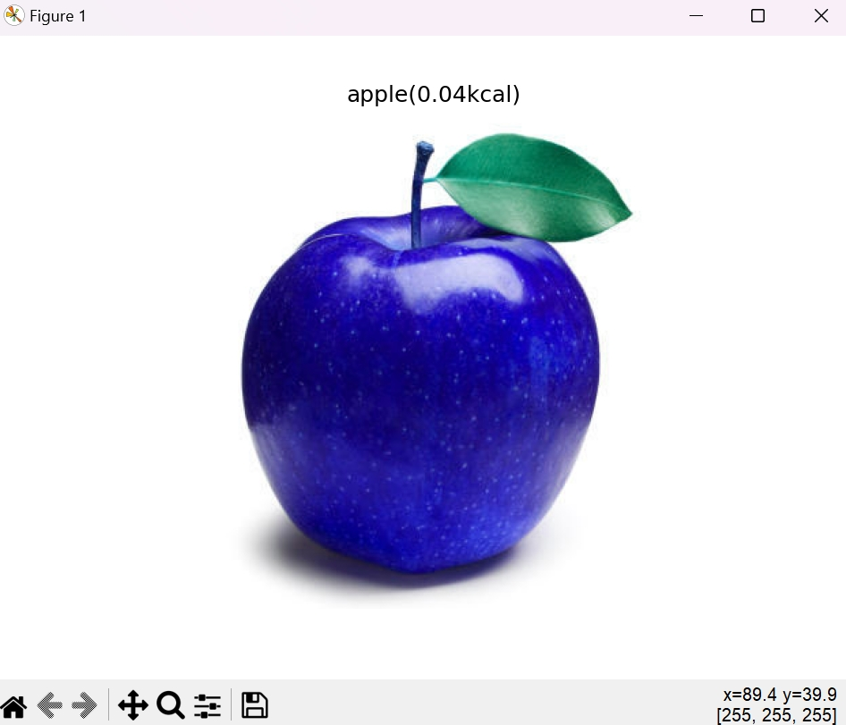

# Food-Calories-Calculator

## Instruction

1. Download the required the packages <br />
2. Download image dataset from https://drive.google.com/drive/folders/1N0wJRQVKfwK2R9XBuSWOBEiHP2tEw4QH?usp=sharing <br />
3. Run ```python train_model.py``` for image classification model <br />
4. Run ```python train1.py``` for image segmentation<br />
5. Run ```python food_calories_estimation``` to find the calories of the food in the image(change ```image_path``` variable to select the image)<br />

## Final Result

Result Image:



Mask Image:
