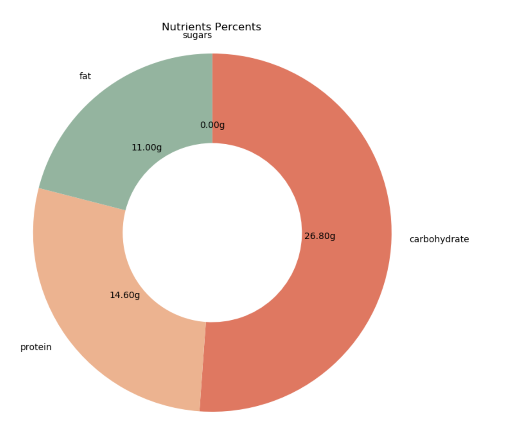

# Food-Calories-Calculator

## Overview
We developed a sophisticated food calorie calculator that utilizes self-supervised learning for depth estimation and novel segmentation approaches. Using the Food-101 dataset, we implemented multiple CNN models, achieving significant improvements in classification accuracy and volume estimation. Our experiments demonstrate that advanced models like ResNet50 significantly enhance performance.

## Methods
#### Food Detection
Model: DenseNet (Densely Connected Convolutional Networks)
Implementation: Fine-tuned fully connected layers of a pre-trained DenseNet model with data augmentation techniques (rotation, width-shift, height-shift, shear, zoom).
Performance: Achieved over 96% accuracy on the Food-101 dataset.
#### Food Segmentation
Model: Mask R-CNN (Region-based Convolutional Neural Network)
Implementation: Utilized ResNet-101 backbone, Region Proposal Network (RPN), and fully convolutional networks for mask prediction.
Performance: High precision in segmenting food items.
#### Depth Estimation
Model: MiDas (Monocular Depth Estimation)
Implementation: Fine-tuned a pre-trained MiDas model for food-specific features, validated against manually annotated data.
Performance: Provided reliable depth maps for accurate volume and weight estimation.
#### Calorie and Nutrition Estimation
Database: Comprehensive food nutrition dataset from Kaggle.
Process:
Volume Calculation: Using depth maps from the MiDas model.
Weight Estimation: Converted volume to weight using predefined density values.
Nutritional Calculation: Queried the nutritional database to estimate calories, carbohydrates, fats, and proteins.

## Results
Food Detection Accuracy: Over 96% on the Food-101 dataset.
Segmentation Precision: High precision with Mask R-CNN.
Depth Estimation Reliability: Reliable depth maps from MiDas model.
Caloric Estimation Accuracy: Less than 10% deviation from laboratory-measured standards.

#### Result Image:<br />

<p align="center">
  
</p>

<p align="center">
  
</p>

Mask Image:<br />
<p align="center">
  
</p>

## Instruction

Download image dataset from https://drive.google.com/drive/folders/1N0wJRQVKfwK2R9XBuSWOBEiHP2tEw4QH?usp=sharing <br />
Download Food Detection Model from: https://drive.google.com/file/d/1mh6kpt2Sc8NjS6oh-7I089FJQ4R-xl2K/view?usp=sharing <br />
Download Segment Weight Model from: https://drive.google.com/file/d/1V3PHdBvsE_YFmjRuu4pwt-90E2aDDKlI/view?usp=sharing <br />
Download Depth Weight Model from: https://drive.google.com/file/d/1PrllWSWypTh7EdVyHJOzKmN4Hd7lv4_Q/view?usp=sharing <br />

```bash
cd Food_volume_estimation
python volume_estimator.py --input_images ../Food_Detection/Myfood/images/test_set/kimbap/Img_069_0755.jpg --depth_model_architecture depth_architecture.json --depth_model_weights depth_weights.h5 --segmentation_weights segmentation_weights.h5
```